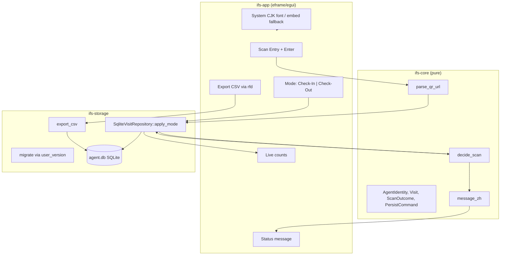
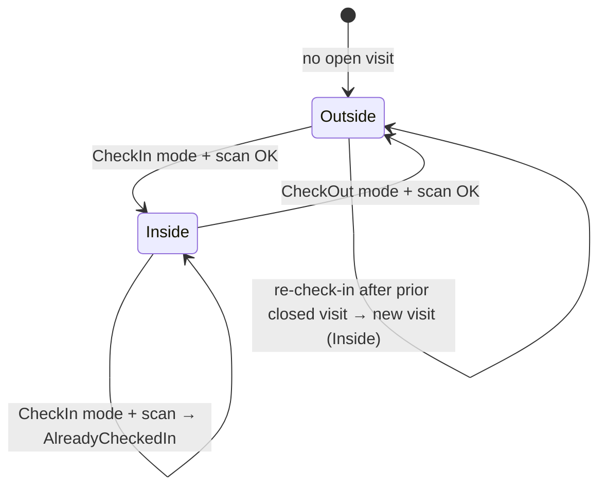

# Design Document: Rust Rewrite of IFS Attendance App (Check-In + Check-Out)

| Field | Value |
|-------|-------|
| **Title** | Rust Rewrite of IFS AML Seminar Attendance Checker |
| **Author** | TBD |
| **Date** | 2026-08-07 (rev 4: 2026-08-08) |
| **Status** | Ready for Implementation |
| **Workspace** | `/home/simon/code/ifs_attandance` |
| **Source baseline** | `ifs_app.py` (~165 lines, Tkinter + SQLite) |
| **Revision** | 5 — CPD time-window eligibility (K26, rev 4: multi-laptop offline master merge K21–K25) |

---

## Overview

The existing IFS Attendance Checker is a single-file Python Tkinter kiosk used at AML seminar desks. An operator (or barcode/QR scanner) pastes a 中介人一戶通 QR URL into a focused entry field and presses Enter; the app parses `categoryCode` and `licenseNo`, records attendance in local SQLite (`agent.db`), shows 已登記 / 已登記 (重複), updates a live headcount, and can export CSV via a File menu.

This document proposes a full rewrite in Rust that:

1. Ships a single Windows `.exe` with a clear GUI stack recommendation (**egui + eframe**), including an explicit **Chinese font packaging** strategy.
2. Introduces a layered, testable crate architecture (`ifs-core` → `ifs-storage` → `ifs-app`).
3. Evolves the product from one-shot “attendance” to explicit **check-in** and **check-out**, with migration from the legacy `attendance` table.
4. Fixes the known uniqueness bug (duplicate *check* stricter than unique *constraint*) deliberately.
5. Documents **intentional behavioral deltas** from Python (strict QR validation, pair identity, non-blocking status).
6. Supports **multiple offline desk laptops** via end-of-event **station package merge** into a master DB/CSV (no live sync).

---

## Background & Motivation

### Current system (`ifs_app.py`)

| Concern | Implementation |
|---------|----------------|
| GUI | Tkinter, 400×300, title `"IFS AML Seminar Attendance Checker"` |
| Input | Label `輸入中介人一戶通QR Code:` + focused `Entry`; global `<Return>` binding |
| QR parse | `urlparse` + `parse_qs` → `categoryCode`, `licenseNo` (defaults to empty string if missing) |
| Storage | SQLite `agent.db`, table `attendance` |
| Schema | `id`, `保險中介人類別`, `保險中介人編號`, `timestamp` (`%Y-%m-%d %H:%M:%S`); `UNIQUE(保險中介人類別, 保險中介人編號)` |
| Messages | `"已登記"` / `"已登記 (重複)"` via blocking `messagebox` |
| Count | `已入場人數: N` (row count) |
| Export | UTF-8-sig CSV; headers `ID, 保險中介人類別, 保險中介人編號, Timestamp`; default name `IFS_AML_seminar_attendance_%d-%B.csv` |
| Ship form | Also present: `ifs_app.exe` (Windows PE32+), empty `agent.db`, `v5.7z` |
| DB access | New `sqlite3.connect('agent.db')` per keypress / export / count refresh |

### Pain points

1. **Monolith**: GUI, parsing, SQL, export, and messages are intertwined in one script — no unit tests, hard to evolve rules safely.
2. **Duplicate-check bug** (must fix) — verified in `ifs_app.py` lines 23–27 vs schema UNIQUE:
   - **Pre-insert check:** `SELECT COUNT(*) FROM attendance WHERE 保險中介人編號 = ?` — **license number only**.
   - **Schema constraint:** `UNIQUE(保險中介人類別, 保險中介人編號)` (table + optional `idx_attendance_unique`).
   - **Dominant failure mode:** Same `licenseNo`, different `categoryCode` → false `"已登記 (重複)"` and **no insert**, even though the composite UNIQUE would allow both rows. This is the user-visible bug to fix.
   - **Secondary issue:** Empty `licenseNo` (garbage/malformed scans) collapses many bad scans into one “duplicate” bucket under the license-only check; Python will also **insert** empty category/license when params are missing (silent empty strings from `parse_qs` defaults).
   - **Weaker secondary:** Check is *stricter* than constraint in single-threaded use; when the check passes, the composite UNIQUE almost never rejects. True check-vs-constraint “disagreement races” are theoretical for this kiosk.
3. **No check-out**: only a single timestamp; seminars need entry + exit for compliance / duration.
4. **Python/Tk runtime**: distribution and ops on locked-down Windows seminar PCs is awkward vs a single native binary.
5. **No domain model**: no explicit result types, no session semantics, no re-entry policy.

### Why rewrite now

- Add check-in/check-out without bolting more logic onto the Tk script.
- Make rules (QR parse, uniqueness, state transitions) **unit-testable** without a display.
- Prefer a maintainable pure-Rust stack that builds one `.exe` for Windows kiosks.

### Behavioral deltas from Python (intentional)

These are **breaking / deliberate product changes**, not accidental drift. Operators and implementers must treat them as requirements.

| Area | Python (`ifs_app.py`) | Rust v1 (this design) |
|------|----------------------|------------------------|
| Missing / empty `categoryCode` or `licenseNo` | Inserts with `''`; may show 已登記 or 已登記 (重複) | **`InvalidQr`** — no insert. Empty input after trim → **`EmptyInput`** (no insert, soft status). |
| Duplicate identity | Check by `license_no` only | Check and store by **`(category, license_no)`** always |
| Check-out | Not supported | Explicit **離場** mode |
| Re-entry after leave | Impossible (one row forever) | New visit row allowed after check-out |
| Feedback UI | Blocking `messagebox` every scan | **Non-blocking status banner** (throughput); export may use a short success status |
| Count label | `已入場人數` = all rows | **目前在場** = open visits; **累計人次** = distinct agents (owner: repeated scans of one person must not add up) |
| Field clear | Always clears entry after Enter | **Always clear + refocus after every submit** (success, duplicate, invalid, empty) — matches Python clear-on-all-submits |
| Invalid/garbage QR | Often stored as empty strings | Never persisted |

**Tests that encode the Python→Rust break:** fixtures that Python would have inserted with empty strings **must not** produce rows in Rust; same `license_no` + different `category` must allow two open visits.

---

## Goals & Non-Goals

### Goals

1. Rewrite in Rust with a recommended Windows GUI stack and single-exe packaging story (including Chinese font strategy).
2. Layered architecture: pure domain crate, SQLite storage crate, thin GUI binary.
3. Support **check-in** and **check-out** with mode-toggle UX.
4. Migrate existing `agent.db` / `attendance` data when present, with a documented rollback runbook.
5. Preserve kiosk UX: focused scan field, Enter/scanner submit, large live counts, Chinese operator messages.
6. Extensive unit tests on domain + storage; high coverage on business rules.
7. Fix identity uniqueness to be consistently `(category, license_no)`.
8. **Multi-laptop master result (v1.1):** offline station packages → admin import → de-duplicated master rollup (see [Multi-station offline master merge](#multi-station-offline-master-merge-v11)).

### Non-Goals

- **Live** multi-writer networking / central server during the seminar (no real-time shared DB)
- Cloud sync of live `agent.db` (Syncthing/OneDrive on open files)
- Auth / multi-operator accounts
- Mobile apps
- Non-Windows as a primary target (cross-platform stack is a bonus, not a requirement)
- OCR / camera QR decoding (scanner still acts as keyboard wedge)
- **Multi-event / multi-venue productization** — no `event_id` in desk schema. **One desk `agent.db` file = one seminar event on one machine.** Multi-day continuous use of the same file is allowed only as “all data in this file”; operators who need a clean event start a fresh DB or archive the old file. Master DB holds merged station packages for one event run.
- Dual-write compatibility layer with Python
- Multi-process concurrent writers on **one** desk DB

---

## Key Decisions

| # | Decision | Rationale |
|---|----------|-----------|
| K1 | **GUI: egui + eframe** (primary) | Pure Rust, simple forms, excellent domain isolation, trivial single-exe via `eframe`; no WebView2. Scanner keyboard wedge + paste are the primary input paths (**verified requirement**). **IME composition is best-effort**, not guaranteed across egui/winit versions—acceptable because operators rarely type QRs by hand. Packaging deps: **`rfd`** for native save dialogs; release build uses `#![windows_subsystem = "windows"]` to avoid console flash on double-click. Rejected WinSafe (boilerplate), Slint (#2 fallback), Tauri (WebView overkill), Iced/GTK (weaker Windows fit). |
| K1b | **Chinese fonts: system-first, embed fallback** | At startup load Windows fonts in order: `C:\Windows\Fonts\msyh.ttc` (Microsoft YaHei), then `msjh.ttc` / `msjh.ttf` (JhengHei), then `msyhbd.ttc`. If none load, fall back to an **embedded subset** of Noto Sans SC (or TC) shipped as `assets/NotoSansSC-subset.otf` via `include_bytes!` (~1–3 MB subset targeting UI strings + common CJK; full Noto CJK is 10MB+ and avoided). **Missing both → show English error dialog and exit** (do not ship blank tofu UI). Font work is launch-blocking and belongs in the GUI spike/PR, not polish. **Slint fallback trigger:** if system+embed fonts fail to render Chinese labels on a clean Win10/11 image during PR0 spike, stop further egui investment and re-evaluate Slint before PR5 body of work. |
| K2 | **Three-crate workspace** (`ifs-core`, `ifs-storage`, `ifs-app`) | Domain pure (no I/O); storage owns rusqlite/migrations/CSV; app is wiring only. Two-crate (core+app with storage modules) rejected to keep storage tests independent of eframe. |
| K3 | **UX: Mode toggle (Check-In / Check-Out)** | Seminar control desks: accidental check-out at entry is costly; operator sets mode explicitly. Auto-flip (A) rejected as primary. |
| K4 | **One open visit per agent identity** | Row with `check_in_at` NOT NULL, `check_out_at` NULL while inside; check-out sets `check_out_at`. Enforced by partial unique index on `(category, license_no) WHERE check_out_at IS NULL`. |
| K5 | **Allow re-check-in after check-out** (second visit = new row) | Default for multi-session days / lunch return. Frozen for v1 (not an open product question). |
| K6 | **Identity = `(category, license_no)` everywhere** | Fixes dominant Python bug (false duplicate across categories). Empty category **and** empty license are **rejected at parse** (never stored). |
| K7 | **Timestamps: local wall time ISO-8601 without timezone** (`YYYY-MM-DDTHH:MM:SS`) as TEXT | Matches seminar wall-clock model of old `%Y-%m-%d %H:%M:%S`. Machine timezone must be correct. Use **`chrono`** with `Local` for `now` and formatting; **do not** depend on OS locale for month names in export filenames. |
| K8 | **Schema English identifiers; Chinese in UI/CSV labels** | Easier Rust code; CSV keeps Chinese headers for operators. |
| K9 | **rusqlite** for SQLite | Sync API fits single-threaded UI; mature; easy `:memory:` tests. Prefer over sqlx (async runtime unnecessary). |
| K10 | **Single long-lived `rusqlite::Connection` on UI thread** | `eframe` app owns one `Connection` (not `Sync`—never share across threads). Set `PRAGMA busy_timeout = 5000`. **Two kiosk processes on one DB are unsupported**; SQLite locking may serialize or error—document “one instance only.” Open-per-keypress (Python style) rejected to avoid repeated migrate checks and handle churn. |
| K11 | **Session / counts model (v1 frozen; metric updated by owner)** | One `agent.db` = one event dataset on one machine. **No `event_id`.** Counts are **all-time within the file**: `currently_inside` = `COUNT(*) WHERE check_out_at IS NULL`; `total_visits` = `COUNT(*)` (per-cycle rows; diagnostics/export); `unique_agents` = `COUNT(DISTINCT category, license_no)`. UI primary large label: **目前在場** (`currently_inside`); secondary: **累計人次** (`unique_agents`) — owner decision 2026-09-08: repeated in/out cycles of one person must not inflate it. |
| K12 | **Strict QR identity (breaking vs Python)** | Both `categoryCode` and `licenseNo` required and non-empty after trim/decode; else `InvalidQr`. Whitespace-only input → `EmptyInput`. |
| K13 | **Non-blocking status banner; no sound in v1** | No per-scan modal. Status line shows last outcome + identity. Export shows success/failure in status. **No beep/audio** (product owner final). |
| K14 | **DB path resolution** | (1) If `--db <path>` CLI arg present, use it. (2) Else `<exe_dir>/agent.db` if exe dir is known. (3) Else `./agent.db` (cwd). Create file if missing. Log resolved path at startup and show in About. |
| K15 | **Schema version = `PRAGMA user_version` only** | Integer versions; **no** `schema_migrations` table. See [Migration versioning](#migration-versioning-authoritative). |
| K16 | **Mutable visit row** (`check_out_at` updated in place) | Simpler queries/CSV than append-only event log for v1 kiosk scale. |
| K17 | **Clear scan field on every submit** | Including invalid/empty/duplicate—matches Python and keeps scanner flow reliable. |
| K18 | **CSV default filename: English month names** (`%d-%B` style) | Product owner final: e.g. `IFS_AML_seminar_attendance_07-August.csv`. Implement via fixed English month map in `default_export_filename` (not OS locale). Matches Python `strftime("%d-%B")` English form. |
| K19 | **Legacy empty category kept on migrate** | Product owner final: import with `COALESCE(保險中介人類別,'')` so historical rows with empty category remain as `category=''`. Do **not** skip or rewrite those rows. New scans still reject empty category (K12). |
| K20 | **No sound effects in v1** | Product owner final: status banner only; no success/failure beep. |
| K21 | **Per-laptop `station_id` (UUID) + editable `station_name`** | Required for multi-desk provenance. Immutable id; human label for UI/export. Stored next to DB (`station.toml`) and stamped on every local visit row (schema v2). |
| K22 | **Master result = offline end-of-event package merge** | Product: 2–4 desks, unreliable network, merge only after seminar. Each desk exports a station package; admin imports into `master.db`. No shared live SQLite, no LAN server in v1.1. |
| K23 | **Master rollup de-dupes by `(category, license_no)`** | `first_check_in_at = MIN(check_in_at)`; `last_check_out_at` from paired/closed visits; `stations_seen`; flag `needs_review` if open on any station or clock skew. “Did they attend?” = at least one check-in anywhere. |
| K24 | **Soft check-out default for multi-station** | Exit desk may record check-out even if local presence is Outside (`OrphanCheckOut` event/row). Master pairs to earliest unmatched open check-in with `open_at <= close_at`. Single-desk events may leave soft check-out on (harmless) or toggle off in Settings. |
| K25 | **Never share one live `agent.db` across machines** | No network path, OneDrive, or USB hot-swap of an open DB. Transfer only via **export package** / file copy when app is closed or package is a snapshot. |
| K26 | **CPD eligibility = per-event time windows (owner 2026-09-08)** | Settings define optional check-in/check-out windows (`HH:MM`, inclusive, blank bound = unbounded) + CPD points (blank = 2) in `app_meta`. CSV exports gain a `CPD` column: points when check-in **and** check-out fall inside their windows, `0` otherwise, blank when no windows set. Desk CSV evaluates per visit; master CSV evaluates per agent (`first_check_in_at`/`last_check_out_at`). Desk CSV drops the `station_id` and `visit_uid` columns (owner: meaningless in a desk export; both stay in the DB — `visit_uid` remains the package-import dedupe key). |

---

## Proposed Design

### High-level architecture



### Workspace layout

```
ifs-attendance/                 # Cargo workspace root (new; can replace or sit beside Python)
  Cargo.toml                    # workspace members
  crates/
    ifs-core/
      Cargo.toml                # thiserror; no chrono required if timestamps are &str
      src/
        lib.rs
        identity.rs             # AgentIdentity
        parse.rs                # parse_qr_url, ParseError
        model.rs                # Visit, VisitPresence, AttendanceMode, ScanOutcome, PersistCommand
        service.rs              # decide_scan()
        messages.rs             # message_zh()
        error.rs
        counts.rs               # AttendanceCounts
    ifs-storage/
      Cargo.toml                # ifs-core, rusqlite, csv, chrono, thiserror
      src/
        lib.rs
        db.rs                   # open_database, pragmas, long-lived connection helper
        migrate.rs              # user_version migrations + legacy import
        repository.rs           # VisitRepository + SqliteVisitRepository
        export.rs               # CSV export + default_export_filename()
    ifs-app/
      Cargo.toml                # ifs-core, ifs-storage, eframe, egui, rfd, tracing, chrono
      src/
        main.rs                 # windows_subsystem, CLI --db, tracing init
        app.rs                  # eframe App; owns Connection via repository
        ui.rs
        fonts.rs                # system font load + embed fallback
        paths.rs                # resolve agent.db
      assets/
        NotoSansSC-subset.otf   # embed fallback (subsetted)
  testdata/                     # golden legacy DBs for migration tests
  README.md
```

### Crate responsibilities

| Crate | Depends on | May do | Must not do |
|-------|------------|--------|-------------|
| **ifs-core** | `thiserror` only (optional `url` if used) | Parse URL, validate identity, pure `decide_scan`, `message_zh`, DTOs | File I/O, SQLite, GUI, system clock |
| **ifs-storage** | ifs-core, rusqlite, csv, chrono | Migrations, load presence, call `decide_scan`, execute `PersistCommand` in a transaction, counts, CSV | GUI, re-implement transition rules without calling core |
| **ifs-app** | ifs-core, ifs-storage, eframe, rfd | Fonts, focus, mode UI, wire scan → parse → `repo.apply_mode`, export dialog, `--db` | Encode business rules |

### Canonical control flow (frozen)

**Single policy implementation:** transition rules live **only** in `ifs_core::decide_scan`. Storage must not re-implement if/else presence logic except to load DB state and apply returned commands.

```text
on_submit(raw):
  clear field + request focus                    # K17 — always
  now = local_now_iso()                          # app, via chrono Local
  match parse_qr_url(raw):                       # core
    Err(ParseError::Empty)     -> status = message_zh(EmptyInput); return
    Err(ParseError::Invalid)   -> status = message_zh(InvalidQr); return
    Ok(identity) ->
      outcome = repo.apply_mode(mode, &identity, &now)   # storage transaction
      status = message_zh(&outcome)
  counts = repo.counts()
```

Inside `SqliteVisitRepository::apply_mode` (one transaction):

1. `BEGIN IMMEDIATE`
2. `SELECT id, check_in_at FROM visits WHERE category=? AND license_no=? AND check_out_at IS NULL`
3. Map row → `VisitPresence` + `open_visit_id` / `open_check_in_at`
4. `(outcome, cmd) = decide_scan(mode, presence, identity, now, open_visit_id, open_check_in_at)`
5. Match `cmd`: `InsertCheckIn` / `UpdateCheckOut` / `None`
6. On `UNIQUE` constraint failure (partial index): re-read open visit; if present return `AlreadyCheckedIn`, else `Failed { message: stable }`
7. `COMMIT`
8. Return `outcome`

### Domain model (`ifs-core`)

#### Types

```rust
/// Insurance intermediary identity extracted from 一戶通 QR URL.
#[derive(Debug, Clone, PartialEq, Eq, Hash)]
pub struct AgentIdentity {
    /// 保險中介人類別 — from query `categoryCode` (non-empty)
    pub category: String,
    /// 保險中介人編號 — from query `licenseNo` (non-empty)
    pub license_no: String,
}

#[derive(Debug, Clone, Copy, PartialEq, Eq)]
pub enum AttendanceMode {
    CheckIn,
    CheckOut,
}

#[derive(Debug, Clone, PartialEq, Eq)]
pub struct Visit {
    pub id: i64,
    pub identity: AgentIdentity,
    pub check_in_at: String,   // ISO local: "YYYY-MM-DDTHH:MM:SS"
    pub check_out_at: Option<String>,
}

#[derive(Debug, Clone, Copy, PartialEq, Eq)]
pub enum VisitPresence {
    /// Has open visit: check_out_at is None
    CheckedIn,
    /// No open visit (never visited or all visits closed)
    CheckedOut,
}

/// Outcome of one scan under a mode — drives UI message + optional persistence command.
#[derive(Debug, Clone, PartialEq, Eq)]
pub enum ScanOutcome {
    CheckedIn { identity: AgentIdentity, at: String },
    AlreadyCheckedIn { identity: AgentIdentity, check_in_at: String },
    CheckedOut { identity: AgentIdentity, check_out_at: String },
    NotCheckedIn { identity: AgentIdentity },
    InvalidQr { reason: String },
    EmptyInput,
    Failed { message: String },
}

#[derive(Debug, Clone, PartialEq, Eq)]
pub enum PersistCommand {
    InsertCheckIn { identity: AgentIdentity, at: String },
    UpdateCheckOut { visit_id: i64, at: String },
}

#[derive(Debug, Clone, Copy, PartialEq, Eq, Default)]
pub struct AttendanceCounts {
    /// Open visits: check_out_at IS NULL
    pub currently_inside: u64,
    /// DISTINCT (category, license_no) all-time in this DB file
    pub unique_agents: u64,
    /// Total visit rows (including closed) — UI "累計人次"
    pub total_visits: u64,
}
```

#### QR / URL parsing (strict)

```text
Input: full URL string from scanner (may include whitespace)
Parse: url::Url or equivalent query extraction (also accept raw query-only strings if needed in tests)
Query: categoryCode, licenseNo (first value if multi)
Rules:
  - trim outer whitespace
  - empty after trim → ParseError::Empty → EmptyInput
  - missing categoryCode or licenseNo OR either empty after URL-decode/trim → ParseError::Invalid { reason }
  - valid → Ok(AgentIdentity { category, license_no })
```

Python reference (`ifs_app.py`) — **legacy lenient behavior we deliberately break**:

```python
parsed_url = urlparse(url)
query_params = parse_qs(parsed_url.query)
category = query_params.get('categoryCode', [''])[0]  # may be ''
number = query_params.get('licenseNo', [''])[0]      # may be ''
# then INSERT even if both empty
```

Example valid URL shape:

```text
https://example.hk/...?categoryCode=XXX&licenseNo=12345678
```

**Tests must cover**: valid both params; missing one; empty values; fragment-only; non-URL garbage; URL-encoded values; duplicate query keys (first wins); leading/trailing whitespace; `+` / `%20`; **regression: inputs that Python would insert as empty must yield `Invalid`/`Empty` and zero DB rows**.

#### State machine (mode-based)

Presence = existence of a row for identity with `check_out_at IS NULL` (at most one, by partial unique index).



| Mode | Presence | Result | Persistence |
|------|----------|--------|-------------|
| CheckIn | Outside | `CheckedIn` | `InsertCheckIn` |
| CheckIn | Inside | `AlreadyCheckedIn` | none |
| CheckOut | Inside | `CheckedOut` | `UpdateCheckOut` |
| CheckOut | Outside | `NotCheckedIn` | none |

`InvalidQr` / `EmptyInput` are produced by the parse step **before** `decide_scan` (or `decide_scan` is not called). `decide_scan` assumes a valid `AgentIdentity`.

#### Operator messages (Chinese)

| Outcome | Message |
|---------|---------|
| CheckedIn | `已登記入場` |
| AlreadyCheckedIn | `已在場內 (重複入場)` |
| CheckedOut | `已登記離場` |
| NotCheckedIn | `尚未入場，無法離場` |
| InvalidQr | `QR Code 無效` |
| EmptyInput | `請掃描 QR Code` (soft status only) |
| Failed | `操作失敗: {detail}` |

#### Counts (live labels) — frozen

| UI label | Field | SQL (conceptual) |
|----------|-------|------------------|
| **目前在場** (primary, large) | `currently_inside` | `SELECT COUNT(*) FROM visits WHERE check_out_at IS NULL` |
| **累計人次** (secondary) | `unique_agents` | `SELECT COUNT(*) FROM (SELECT DISTINCT category, license_no FROM visits)` |
| (About / diagnostics only) | `total_visits` | `SELECT COUNT(*) FROM visits` — one row per in→out cycle |

---

## GUI recommendation

### Primary choice: **egui + eframe**

| Criterion | Assessment |
|-----------|------------|
| Native OS widgets? | No — custom immediate-mode; File export via **`rfd`** native dialogs |
| Chinese display | **Requires explicit font load** (K1b)—not automatic |
| Scanner keyboard wedge + paste | Primary supported path |
| IME typing | Best-effort only |
| Single `.exe` | Yes; embed font subset adds ~1–3 MB if system fonts missing |
| Console | Release: `#![windows_subsystem = "windows"]` |
| A11y | Acceptable for internal kiosk |

### Rejected / fallback

| Option | Verdict | Trade-off |
|--------|---------|-----------|
| **Slint** | Strong #2; **fallback if PR0 font spike fails** | DSL + build integration; use only if egui cannot render Chinese reliably on target images |
| **WinSafe** | Reject unless native Win32 widgets mandated | More boilerplate |
| **Tauri / Dioxus** | Reject | WebView2 overkill |
| **Iced** | Reject | Weaker Windows a11y/IME history |
| **GTK / Relm4** | Reject | Non-native Windows look |

### UX wire description (scanner flow)

```text
+----------------------------------------------------------+
|  IFS AML Seminar Attendance          [File ▾ Export CSV] |
+----------------------------------------------------------+
|  模式:  (•) 入場 Check-In    ( ) 離場 Check-Out           |
|                                                          |
|  輸入中介人一戶通 QR Code:                                 |
|  [________________________________________]  ← autofocus |
|                                                          |
|           目前在場:  42                                   |
|           累計人次:  128                                  |
|                                                          |
|  狀態: 已登記入場  (category / license_no)                |
+----------------------------------------------------------+
```

**Scanner flow (happy path, Check-In mode):**

1. Window opens; Chinese fonts loaded (K1b); focus on QR entry.
2. Operator ensures mode is **入場** (default on launch: Check-In).
3. Scanner wedges URL + Enter (or paste + Enter).
4. App always clears field and refocuses (K17).
5. Parse → `apply_mode` → status banner (non-blocking).
6. Counts refresh.

**Keyboard:**

- `Enter` / `Return` → submit scan.
- Optional later: `F2` toggle mode (not required v1).
- Mode radios: large, green accent for 入場 / orange for 離場.

---

## API / Interface Changes (frozen names)

No network API. **These names are canonical** — do not introduce `apply_scan`, `message_for`, or `format_status` as public aliases.

### `ifs-core`

```rust
#[derive(Debug, Clone, PartialEq, Eq, thiserror::Error)]
pub enum ParseError {
    #[error("empty input")]
    Empty,
    #[error("invalid QR: {reason}")]
    Invalid { reason: String },
}

/// Trim, extract categoryCode + licenseNo; both must be non-empty.
pub fn parse_qr_url(input: &str) -> Result<AgentIdentity, ParseError>;

/// Pure state transition. Caller supplies presence from storage.
/// Does not handle parse errors — only valid identities.
pub fn decide_scan(
    mode: AttendanceMode,
    presence: VisitPresence,
    identity: AgentIdentity,
    now_iso: &str,
    open_visit_id: Option<i64>,
    open_check_in_at: Option<&str>,
) -> (ScanOutcome, Option<PersistCommand>);

/// Chinese operator-facing status string.
pub fn message_zh(outcome: &ScanOutcome) -> String;
```

### `ifs-storage`

```rust
pub struct MigrateReport {
    pub from_version: i32,
    pub to_version: i32,
    pub legacy_rows_copied: u64,
    pub legacy_rows_skipped: u64,
    pub backup_table_name: Option<String>,
    pub already_current: bool,
}

pub trait VisitRepository {
    /// Load presence, call ifs_core::decide_scan, apply PersistCommand in one transaction.
    fn apply_mode(
        &self,
        mode: AttendanceMode,
        identity: &AgentIdentity,
        now_iso: &str,
    ) -> Result<ScanOutcome, StorageError>;

    fn counts(&self) -> Result<AttendanceCounts, StorageError>;

    fn export_csv(&self, path: &std::path::Path) -> Result<u64, StorageError>;
}

/// Opens DB, applies PRAGMAs (busy_timeout=5000), runs migrate().
pub fn open_database(path: &std::path::Path) -> Result<(rusqlite::Connection, MigrateReport), StorageError>;

pub fn migrate(conn: &mut rusqlite::Connection) -> Result<MigrateReport, StorageError>;

/// English month names fixed: 01-January … 31-December pattern.
pub fn default_export_filename(now: chrono::DateTime<chrono::Local>) -> String;
```

**Note:** `SqliteVisitRepository` holds `&Connection` or owns it; constructed once in `App` after `open_database`.

### `ifs-app`

- Binary only.
- CLI: optional `--db <path>` (K14).
- `fonts.rs` implements K1b.
- `#![windows_subsystem = "windows"]` in release (`main.rs` / Cargo profile cfg).

---

## Data Model Changes

### Legacy schema (as on disk today)

```sql
CREATE TABLE attendance (
    id INTEGER PRIMARY KEY AUTOINCREMENT,
    保險中介人類別 TEXT,
    保險中介人編號 TEXT,
    timestamp TEXT,
    UNIQUE(保險中介人類別, 保險中介人編號)
);
```

Current workspace DB: table exists, **0 rows**. Live DBs may also have `sqlite_autoindex_attendance_1`.

### New schema (at `user_version = 1`)

```sql
CREATE TABLE visits (
    id            INTEGER PRIMARY KEY AUTOINCREMENT,
    category      TEXT    NOT NULL,  -- 保險中介人類別
    license_no    TEXT    NOT NULL,  -- 保險中介人編號
    check_in_at   TEXT    NOT NULL,  -- local ISO "YYYY-MM-DDTHH:MM:SS"
    check_out_at  TEXT,              -- NULL while inside
    created_at    TEXT    NOT NULL,  -- bookkeeping; on migrate = check_in_at
    notes         TEXT               -- reserved; unused in v1
);

-- At most one open visit per agent (allows re-entry rows when closed)
CREATE UNIQUE INDEX IF NOT EXISTS idx_visits_one_open
    ON visits (category, license_no)
    WHERE check_out_at IS NULL;

-- Identity lookups (check-in/out path)
CREATE INDEX IF NOT EXISTS idx_visits_identity
    ON visits (category, license_no);
```

**Dropped relative to draft r1:** `idx_visits_open` on `check_out_at` — low value because partial unique already covers open-row access patterns; counts of all open rows are cheap at seminar scale (hundreds–thousands of rows).

`category` / `license_no` are `NOT NULL` and application parse rejects empties; migration also skips empty `license_no` after trim.

### Migration versioning (authoritative)

**Single source of truth: `PRAGMA user_version`.**

Do **not** create a `schema_migrations` table.

| `user_version` | Meaning |
|----------------|---------|
| **0** | Unmigrated: empty DB, or legacy Python DB with `attendance` only (or unknown pre-Rust state) |
| **1** | Rust v1 schema: `visits` + `idx_visits_one_open` + `idx_visits_identity`; legacy `attendance` imported and renamed if it existed |

**Future:** v2, v3, … each is a forward-only step in `migrate()` matching on `user_version`.

#### `migrate()` algorithm (idempotent, fail-loud)

```text
BEGIN IMMEDIATE;
v = PRAGMA user_version;

if v == 1:
  COMMIT;
  return MigrateReport { from_version: 1, to_version: 1, already_current: true, ... };

if v > 1:
  ROLLBACK;
  return error "database newer than this binary (user_version={v})";

if v < 0:
  ROLLBACK;
  return error "invalid user_version";

# v == 0 → upgrade to 1
if table_exists("visits") AND not indexes_complete:
  ROLLBACK;
  return error "incomplete schema (visits present but user_version=0); restore file backup";

if table_exists("visits") AND indexes_complete AND not table_exists("attendance"):
  # Odd state: treat as already structurally v1 but version not stamped — stamp only after verify
  verify_v1_schema_or_fail();
  PRAGMA user_version = 1;
  COMMIT;
  return report stamped;

# Pre-validation when attendance exists
if table_exists("attendance"):
  run validation queries (see below); on failure ROLLBACK + error with counts

CREATE TABLE visits (...);  # if not exists
# Import (see SQL below) if attendance exists
# Create indexes
# Rename attendance → attendance_legacy_YYYYMMDDHHMMSS (fixed timestamp at migrate start)
PRAGMA user_version = 1;
COMMIT;
```

**Incomplete migration rule:** If `visits` exists with `user_version = 0` and indexes missing or half-applied, **do not no-op**. Fail with a message instructing restore from **file backup**. Never use “table exists ⇒ ready” alone.

#### Pre-migration validation (when `attendance` present)

```sql
-- Rows that would be skipped (empty license)
SELECT COUNT(*) FROM attendance
WHERE TRIM(COALESCE(保險中介人編號, '')) = '';

-- Duplicate open-identity risk after COALESCE categories
-- (legacy UNIQUE allows multiple NULLs on composite columns in SQLite)
SELECT COALESCE(保險中介人類別, ''), 保險中介人編號, COUNT(*)
FROM attendance
WHERE TRIM(COALESCE(保險中介人編號, '')) != ''
GROUP BY 1, 2
HAVING COUNT(*) > 1;
```

If the duplicate query returns any row → **abort migration** with `MigrateReport`-compatible error text (list pairs). Operator must clean legacy data or restore backup.

#### Legacy import SQL (v0 → v1)

```sql
INSERT INTO visits (category, license_no, check_in_at, check_out_at, created_at)
SELECT
    COALESCE(保險中介人類別, ''),
    TRIM(保險中介人編號),
    CASE
      WHEN timestamp IS NULL OR TRIM(timestamp) = '' THEN strftime('%Y-%m-%dT%H:%M:%S', 'now', 'localtime')
      ELSE replace(trim(timestamp), ' ', 'T')
    END,
    NULL,
    -- created_at = original attendance time (same as check_in_at), NOT migration wall clock
    CASE
      WHEN timestamp IS NULL OR TRIM(timestamp) = '' THEN strftime('%Y-%m-%dT%H:%M:%S', 'now', 'localtime')
      ELSE replace(trim(timestamp), ' ', 'T')
    END
FROM attendance
WHERE TRIM(COALESCE(保險中介人編號, '')) != '';
```

Then:

```sql
ALTER TABLE attendance RENAME TO attendance_legacy_YYYYMMDDHHMMSS;
```

(`YYYYMMDDHHMMSS` = migrate-start local time, stored in `MigrateReport.backup_table_name`.)

**Skipped rows:** empty/NULL `license_no` after trim — counted in `legacy_rows_skipped`. **Empty category is kept** as `''` via `COALESCE(保險中介人類別,'')` (K19, product owner final)—do not skip or rewrite those historical rows. **New** scans still reject empty category at parse (K12).

#### `MigrateReport` fields

| Field | Type | Meaning |
|-------|------|---------|
| `from_version` | `i32` | `user_version` before migrate |
| `to_version` | `i32` | after (1 if success) |
| `legacy_rows_copied` | `u64` | INSERT count |
| `legacy_rows_skipped` | `u64` | empty license rows not copied |
| `backup_table_name` | `Option<String>` | e.g. `attendance_legacy_20260807143000` |
| `already_current` | `bool` | true if no-op at v1 |

Log full report at startup (info).

### Rollback runbook (post-migration)

**Critical:** After rename, launching **Python** `ifs_app.py` / `ifs_app.exe` will call `create_attendance_table()`, see **no** table named `attendance`, and create a **new empty** `attendance` — leaving full data only in `visits` + `attendance_legacy_*`. That is a **split-brain** DB. **Do not run Python against a post-migration database.**

#### Mandatory pilot rule

1. **Always** file-copy `agent.db` → `agent.db.pre-rust-YYYYMMDD.bak` **before** first Rust launch on real data.
2. Side-by-side pilot **must** use a **copy** of the DB (or a throwaway machine), never the only production file, until cutover is accepted.

#### Operator rollback checklist

**Preferred (always works): restore file backup**

1. Stop Rust app (and do not start Python yet).
2. Replace `agent.db` with `agent.db.pre-rust-*.bak` (copy over).
3. Confirm Python opens and `SELECT COUNT(*) FROM attendance` matches pre-migration expectation.
4. Resume Python kiosk.

**If no file backup but `attendance_legacy_*` still present and `visits` was only used briefly**

1. Stop all apps.
2. Open DB with a SQLite tool (or documented `rusqlite` admin note)—**not** Python app auto-migrate.
3. Reverse SQL:

```sql
BEGIN IMMEDIATE;
-- Only if you accept losing any check-outs / new visits recorded only in visits:
DROP TABLE IF EXISTS visits;
DROP INDEX IF EXISTS idx_visits_one_open;
DROP INDEX IF EXISTS idx_visits_identity;
ALTER TABLE attendance_legacy_YYYYMMDDHHMMSS RENAME TO attendance;
PRAGMA user_version = 0;
COMMIT;
```

4. Launch **Python only**. Data is as of legacy import source; **any Rust-only check-outs/new visits are destroyed** by `DROP TABLE visits`.

**If Python already created empty `attendance` after migration (split-brain)**

1. Stop all apps.
2. Inspect tables: `visits`, `attendance` (maybe empty), `attendance_legacy_*`.
3. If empty `attendance` was recreated: `DROP TABLE attendance;` then `ALTER TABLE attendance_legacy_* RENAME TO attendance;` and `DROP TABLE visits;` + `PRAGMA user_version = 0` **only if** discarding Rust-era data is acceptable.
4. If both `attendance` (new rows from Python) **and** `visits` have data → **manual merge required**; prefer restoring `agent.db.pre-rust-*.bak` and re-applying work from CSV exports. Document this as emergency-only.

#### Cutover recommendation

- Keep pre-migration `.bak` until at least one full seminar day succeeds on Rust.
- Keep Python `ifs_app.exe` available but **pointed at the backup file only** if emergency fallback is needed—not at the live migrated path without reverse migration.

### CSV export (new)
| Column (header) | Source |
|-----------------|--------|
| event | `app_meta.event_name` (blank when unset) |
| ID | 1-based row order |
| 保險中介人類別 | `category` |
| 保險中介人編號 | `license_no` |
| 入場時間 | `check_in_at` |
| 離場時間 | `check_out_at` (empty if null) |
| CPD | K26: points when both times inside configured windows, `0` when missed, blank when unconfigured |

The `station_id` and `visit_uid` columns were removed (K26); both remain in the DB — `visit_uid` is still the package-import dedupe key.

- Encoding: **UTF-8 with BOM**.
- Default filename (K18): `IFS_AML_seminar_attendance_%d-%B.csv` with **fixed English** month names via `default_export_filename` (not OS locale)—e.g. `IFS_AML_seminar_attendance_07-August.csv`. Month map: `January`…`December`. Unit-test the month map.

---

## Alternatives Considered

### 1. Auto-toggle scan (UX option A)

Every scan flips presence: outside→in, in→out.

- **Pros:** Fewer clicks.
- **Cons:** Accidental double-scan at entry checks people **out**.
- **Decision:** Reject as default.

### 2. Mode toggle (UX option B) — **chosen**

- **Pros:** Explicit intent for entry vs exit desks.
- **Cons:** Wrong mode if operator forgets.
- **Mitigation:** Large radios; color accent; default Check-In on launch.

### 3. Two-button + scan (UX option C)

- **Cons:** Extra click fights scanner Enter workflow.
- **Decision:** Reject as primary.

### 4. Slint instead of egui

- **Decision:** #2; adopt only if PR0 proves egui Chinese rendering unworkable on target Windows images.

### 5. Keep single visit row / no re-entry

- **Decision:** Reject; K5 multi-visit with one open max.

### 6. Keep Python, only add check-out

- **Decision:** Out of scope of rewrite goals.

### 7. Two-crate workspace (merge storage into app or core)

- **Pros:** Fewer packages.
- **Cons:** Forces GUI or domain to pull rusqlite for tests; muddies pure core.
- **Decision:** Keep three crates (K2).

### 8. sqlx vs rusqlite

- **sqlx:** async, compile-time SQL; heavier runtime for a sync UI app.
- **rusqlite:** sync, fits UI thread, simple `:memory:` tests.
- **Decision:** rusqlite (K9).

### 9. Append-only event log vs mutable `check_out_at`

- **Events:** maximal audit history, more complex “open visit” queries.
- **Mutable row:** one row per visit, simple CSV and counts.
- **Decision:** mutable visit row (K16) at kiosk scale.

---

## Security & Privacy Considerations

| Topic | Assessment |
|-------|------------|
| Threat model | Local kiosk; trusted operators; physical access ≈ full access |
| Auth | None (matches current app) |
| Data sensitivity | License intermediary IDs + category + timestamps — treat DB as sensitive |
| Network | No outbound calls |
| Path traversal | Export path from `rfd` only; never from QR content |
| QR content | Untrusted string; parse query only; do not open browser |
| SQL injection | Parameterized rusqlite only |
| File location | Unencrypted `agent.db`; NTFS ACLs recommended |
| Backup | File backup mandatory before migrate; legacy table rename is secondary safety net |

Severity **Medium** if DB leaves the building; process mitigation, not crypto in v1.

---

## Observability

| Signal | Approach |
|--------|----------|
| Logging | `tracing` + `tracing-subscriber` file `ifs-attendance.log` beside exe (or cwd) |
| Levels | info: check-in/out with redacted identity; warn: invalid QR structural summary; error: DB failures |
| Metrics | On-screen counts only |
| Diagnostics | About: version + resolved db path; log `MigrateReport` at startup |

**Redaction vs debugability:**

- **Info:** `category` + last 4 chars of `license_no` (if len ≥ 4).
- **Warn (invalid QR):** do **not** log full raw URL by default; log `input_len`, `has_category_code_key`, `has_license_no_key`, and a **SHA-256 prefix** (first 8 hex of hash of raw bytes) for correlating scanner glitches without storing PII.
- **Debug:** full raw URL only if env `IFS_ATTENDANCE_LOG_RAW_QR=1` (default off; local kiosk opt-in).

---

## Testing Strategy

### `ifs-core`

| Area | Cases |
|------|-------|
| `parse_qr_url` | Valid; missing/empty params; whitespace; encoding; **Python-would-insert-empty → Invalid/Empty** |
| `decide_scan` | All 4 mode×presence cells; re-entry from Outside after prior visit is storage concern (decide_scan same as fresh Outside) |
| `message_zh` | Exact Chinese strings |
| Identity | Same license, different category → not equal |

Target: near 100% on parse + `decide_scan`.

### `ifs-storage`

| Area | Cases |
|------|-------|
| migrate fresh | empty file → `user_version=1`, visits + indexes |
| migrate legacy | seed `attendance` → rows with `check_in_at` **and** `created_at` from timestamp; backup table name set; `user_version=1` |
| migrate incomplete | visits half-created + v0 → error, not silent success |
| migrate duplicates | NULL/duplicate legacy pairs → abort |
| check-in / AlreadyCheckedIn / check-out / NotCheckedIn / re-entry | full matrix |
| **command round-trip** | For each `decide_scan` path that returns `Some(PersistCommand)`, execute via repository helpers and assert DB state — **storage must call core `decide_scan`**, not fork logic |
| counts | `currently_inside`, `total_visits`, `unique_agents` |
| export_csv | BOM, headers, empty checkout, English month filename helper |
| uniqueness fix | same `license_no`, different `category` → two open visits |
| constraint race | forced double insert open → maps to `AlreadyCheckedIn` or stable `Failed` |

Use tempfile or `:memory:`.

### Golden fixtures (`testdata/`)

- Legacy DB: two categories sharing one license number (would false-duplicate in Python).
- Legacy DB: empty license rows (skipped on migrate).
- Assert after migrate: one open visit per imported pair; second check-in → `AlreadyCheckedIn`.

### `ifs-app`

- Manual checklist: fonts render Chinese on clean Win10/11; focus; Enter; mode switch; export; `--db`.
- No heavy GUI automation required in v1.

### CI

```text
cargo test --workspace
cargo clippy --workspace -- -D warnings
cargo fmt --check
cargo check -p ifs-app   # Windows runner preferred for eframe link
```

---

## Rollout Plan

1. **PR0 spike (mandatory before GUI body):** Chinese fonts (K1b) + scanner Enter on target Windows 10/11. Go/no-go for egui vs Slint.
2. **Implement PR train** (see PR Plan); binary coexists with Python until cutover.
3. **Side-by-side pilot (mandatory):** Rust against a **copy** of production `agent.db`; verify `MigrateReport`, counts, export, rollback restore from `.bak`.
4. **Cutover:** Shortcut → new `.exe`; keep Python exe + `.bak` for one seminar.
5. **Rollback:** Follow [Rollback runbook](#rollback-runbook-post-migration) — prefer file restore; never point Python at migrated live DB without reverse migration.

---

## Open Questions

**None remaining for v1.** All former open questions are closed in Key Decisions (see below).

### Resolved open questions (stakeholder / product owner final)

| Topic | Decision | Key Decision |
|-------|----------|--------------|
| CSV month names | English month names, Python `%d-%B` style (e.g. `IFS_AML_seminar_attendance_07-August.csv`) | K18 |
| Legacy empty category | Keep `category=''` on migrate so historical rows remain | K19 |
| Sound | No sound in v1 — status banner only | K13, K20 |

### Previously closed (design review / engineering defaults)

| Former OQ | Resolution |
|-----------|------------|
| Session boundary | K11: one DB file = one event dataset; all-time counts; no `event_id` |
| Re-entry | K5: allowed |
| Mode UX | K3: mode toggle |
| Modal vs banner | K13: non-blocking banner |
| Timestamp format | K7: local ISO without offset |
| Same license different category | K6: allowed |
| Empty categoryCode on new scans | K12: reject |
| DB path | K14 |
| Font packaging | K1b |

---

## References

- Baseline source: `/home/simon/code/ifs_attandance/ifs_app.py`
- Legacy DB: `/home/simon/code/ifs_attandance/agent.db` (schema `attendance`, 0 rows at research time)
- Shipped binary: `ifs_app.exe` (Windows PE32+)
- Libraries: egui, eframe, rusqlite, chrono, rfd, thiserror, tracing

---

## Risks

| Risk | Severity | Mitigation |
|------|----------|------------|
| egui Chinese font failure | **High** (launch-blocking) | K1b system+embed; PR0 spike gate; SoS → Slint |
| Split-brain DB if Python launched post-migrate | **High** | Rollback runbook; mandatory file backup; README warnings |
| Partial unique index + dirty legacy data | Medium | Pre-migration validation; abort with report |
| Wrong mode double-scan | Medium | Large mode control; clear messages |
| IME flaky for manual typing | Low | Scanner/paste primary; IME best-effort |
| Timestamp timezone wrong on PC | Low | Document set correct Windows timezone |
| Scope creep multi-event | Medium | Non-goals + K11 |

---

## PR Plan

Incremental, independently reviewable PRs. Each keeps `cargo test --workspace` green where applicable.

### PR 0 — Windows font + scanner spike (go/no-go)

| | |
|--|--|
| **Title** | `spike: egui Chinese fonts and scanner Enter on Windows` |
| **Files/components** | Throwaway or `crates/ifs-app` skeleton; `fonts.rs` prototype; spike notes in PR description |
| **Depends on** | None |
| **Description** | Load YaHei/JhengHei; embed subset fallback; render UI strings 入場/離場/輸入中介人…; confirm keyboard-wedge URL + Enter. **Exit criteria:** Chinese visible on clean Win10/11 **or** decision to switch to Slint before PR5. Does not need full domain. |

### PR 1 — Workspace scaffold + `ifs-core` parsing

| | |
|--|--|
| **Title** | `feat: cargo workspace and ifs-core QR parsing` |
| **Files/components** | Root `Cargo.toml`; `crates/ifs-core` (`identity`, `parse`, `ParseError`); unit tests including Python-empty regression |
| **Depends on** | None (parallel with PR0) |
| **Description** | `parse_qr_url` strict behavior (K12). No storage, no GUI. |

### PR 2 — Domain state machine + messages

| | |
|--|--|
| **Title** | `feat(ifs-core): decide_scan state machine and message_zh` |
| **Files/components** | `model.rs`, `service.rs` (`decide_scan`), `messages.rs` (`message_zh`), `counts.rs` types; unit tests |
| **Depends on** | PR 1 |
| **Description** | Freeze public names `decide_scan` / `message_zh` / `PersistCommand`. Clock injected as `now_iso`. |

### PR 3a — Schema, `user_version` migrate, read APIs

| | |
|--|--|
| **Title** | `feat(ifs-storage): visits schema, user_version migrate, counts + open-visit read` |
| **Files/components** | `db.rs`, `migrate.rs`, read helpers; `MigrateReport`; testdata legacy fixtures |
| **Depends on** | PR 2 (types only; can depend PR1 if counts types land in PR2) |
| **Description** | Implement v0→v1 only via `PRAGMA user_version`. Legacy import SQL with `created_at` from timestamp; pre-validation; rename to `attendance_legacy_*`; fail-loud incomplete schema. **Acceptance:** migrate fresh; migrate legacy; abort on duplicate legacy pairs; incomplete v0+visits fails; `counts()` SQL matches K11. **No** `apply_mode` write path yet (except what migrate needs). |

### PR 3b — Transactional `apply_mode`

| | |
|--|--|
| **Title** | `feat(ifs-storage): apply_mode transactions via decide_scan` |
| **Files/components** | `repository.rs`; command round-trip tests |
| **Depends on** | PR 3a, PR 2 |
| **Description** | `VisitRepository::apply_mode` loads presence, calls **`decide_scan` only**, applies `PersistCommand`, maps UNIQUE violations. Tests: full mode matrix, re-entry, cross-category two opens, constraint mapping. |

### PR 4 — CSV export

| | |
|--|--|
| **Title** | `feat(ifs-storage): UTF-8-BOM CSV export and English month filename` |
| **Files/components** | `export.rs`; tests BOM, headers, month map |
| **Depends on** | PR 3a |
| **Description** | Export visits; `default_export_filename` with fixed English `%B`. |

### PR 5 — GUI shell (Check-In only) + fonts

| | |
|--|--|
| **Title** | `feat(ifs-app): eframe shell, fonts, scan field, Check-In wiring` |
| **Files/components** | `ifs-app` main/app/ui/fonts/paths; long-lived connection; migrate on open |
| **Depends on** | PR 0 (go), PR 3b |
| **Description** | **Acceptance bar:** Chinese labels render; autofocus; Enter submit; always clear field; status banner; counts (目前在場 / 累計人次); Check-In mode **only** (no mode radios yet—hardcode `AttendanceMode::CheckIn`). `windows_subsystem`, `--db`, logging. **No** Check-Out UI. |

### PR 6 — Check-Out mode UX

| | |
|--|--|
| **Title** | `feat(ifs-app): Check-In / Check-Out mode toggle` |
| **Files/components** | Mode radios, colors, wire `AttendanceMode` to `apply_mode` |
| **Depends on** | PR 5, PR 2 |
| **Description** | Operator-selectable mode; all `ScanOutcome` messages visible. Scanner flow preserved. |

### PR 7 — Export menu, About, README, packaging notes

| | |
|--|--|
| **Title** | `feat(ifs-app): File → Export CSV, About, logging docs, README` |
| **Files/components** | `rfd` save dialog; About (version + db path); README (backup, rollback runbook, one-instance rule, release build) |
| **Depends on** | PR 4, PR 6 |
| **Description** | Document mandatory `.bak` before migrate; link rollback steps. (Python app later removed from repo; migration of old `attendance` tables remains.) |

### PR 8 — CI, golden fixtures, cutover checklist

| | |
|--|--|
| **Title** | `chore: CI, migration fixtures, cutover and rollback checklist` |
| **Files/components** | CI workflow; `testdata/`; CUTOVER.md or README section |
| **Depends on** | PR 7 |
| **Description** | Windows (+ optional Linux core/storage) CI. Golden migration fixture with shared license across categories. Cutover checklist: backup → pilot on copy → cutover → rollback drill once. Deprecation notice for Python entrypoint in docs only. |

### PR 9 — Station identity + visit provenance (schema v2)

| | |
|--|--|
| **Title** | `feat: station_id, visit_uid, schema user_version 2` |
| **Files/components** | `station.toml`; migrate 1→2; columns on `visits`; About shows station |
| **Depends on** | PR 8 (or PR 5+ if parallelizing carefully) |
| **Description** | K21. Local inserts stamp `station_id` + `visit_uid`. Desk partial unique unchanged. |

### PR 10 — Station package export / master import

| | |
|--|--|
| **Title** | `feat: export station package and idempotent master import` |
| **Files/components** | package export (DB snapshot + manifest); `INSERT OR IGNORE` by `visit_uid`; import audit table |
| **Depends on** | PR 9 |
| **Description** | K22. Admin can re-import same package without duplicates. |

### PR 11 — Master rollup + master CSV

| | |
|--|--|
| **Title** | `feat(ifs-core/storage): master rollup and master CSV export` |
| **Files/components** | pure `rollup_agent`; master counts UI; master CSV columns |
| **Depends on** | PR 10 |
| **Description** | K23. One row per identity: first_in, last_out, stations, needs_review. |

### PR 12 — Soft check-out + master pairing

| | |
|--|--|
| **Title** | `feat: soft check-out and master visit pairing` |
| **Files/components** | `OrphanCheckOut` path; `pair_checkouts` in core; tests for cross-desk in/out |
| **Depends on** | PR 11 |
| **Description** | K24. Exit desk records intent without local check-in; master pairs greedily. |

### PR 13 — Master mode UI + multi-station runbook

| | |
|--|--|
| **Title** | `docs+ui: master mode polish and multi-laptop operator runbook` |
| **Files/components** | Master menus; README end-of-seminar checklist; archive guidance |
| **Depends on** | PR 12 |
| **Description** | USB folder workflow; pilot 2-laptop scenario documented. |

---

## Multi-station offline master merge (v1.1)

**Product constraints (owner):** end-of-seminar merge only; network often unreliable; same agent may scan on multiple desks; 2–4 desks + one admin laptop as master.

### Architecture

```text
Desk 1 agent.db  ─┐
Desk 2 agent.db  ─┼─ USB / email ─► Admin imports ─► master.db ─► master CSV
Desk 3 agent.db  ─┘
```

Desks remain fully offline during the event. **No live sync.**

### Cross-desk check-out problem

Check-in on laptop A, check-out on laptop B fails under strict local presence (B never saw the check-in). **Soft check-out (K24)** records an orphan check-out on B; **master pairing** matches it to the earliest unmatched open check-in with `open_at <= close_at`.

### Station package

- Preferred: snapshot `.db` named `IFS_station_<name>_<YYYYMMDD-HHMMSS>.db` (+ optional JSON manifest: `station_id`, `station_name`, `exported_at`, counts).
- Import is **idempotent** via `visit_uid` UNIQUE / `INSERT OR IGNORE`.

### Master rollup (one row per agent)

| Field | Rule |
|-------|------|
| first_check_in_at | `MIN(check_in_at)` across stations |
| last_check_out_at | From pairing / max closed; empty if any open remains |
| stations_seen | Distinct stations |
| status | 已離場 / 仍在場 / 僅入場 |
| needs_review | Dual open, clock skew (out before in), orphan out only |

### Operator runbook

1. Each desk: **Export station package** → USB `/Stations/`
2. Admin: open **Master** DB → **Import** all packages
3. Review 總出席 / 仍在場 / needs_review
4. **Export master CSV** for compliance
5. Archive packages + `master.db` + CSV by event date

### Rejected approaches

| Approach | Why |
|----------|-----|
| Shared network SQLite | Multi-writer risk, needs LAN |
| Cloud/Syncthing on live DB | Conflict copies, data loss |
| Central server during event | Offline constraint |
| Manual Excel union only | Error-prone; interim until PR10–11 |

### Delivery relative to single-machine

- **Phase A:** PR0–PR8 (single machine) — ship first.
- **Phase B–F:** PR9–PR13 (multi-station) — additive; does not change desk scan happy path except soft check-out and station labels.

---

*End of design document (revision 4).*
